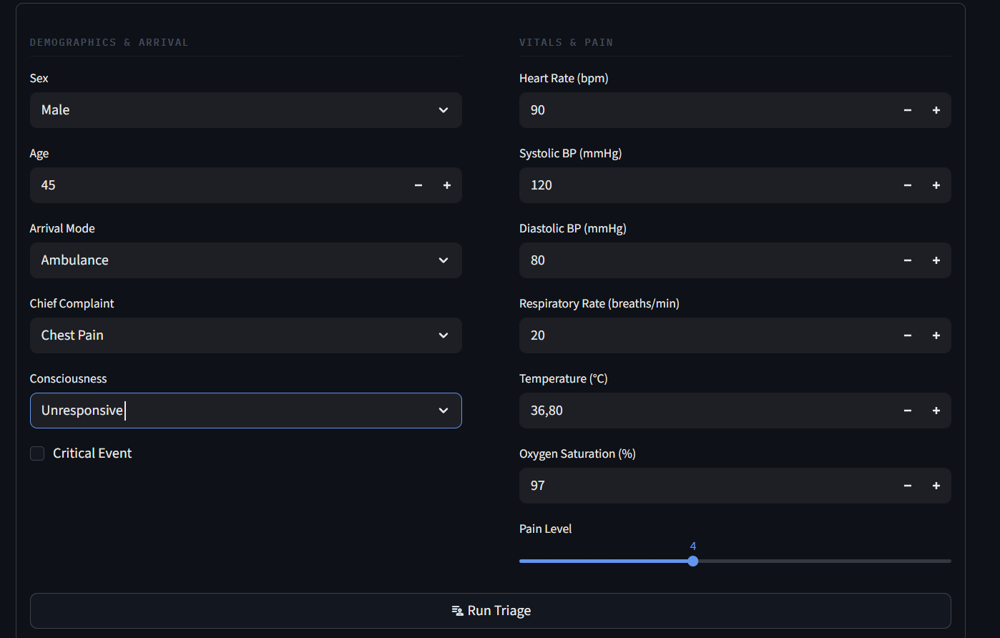
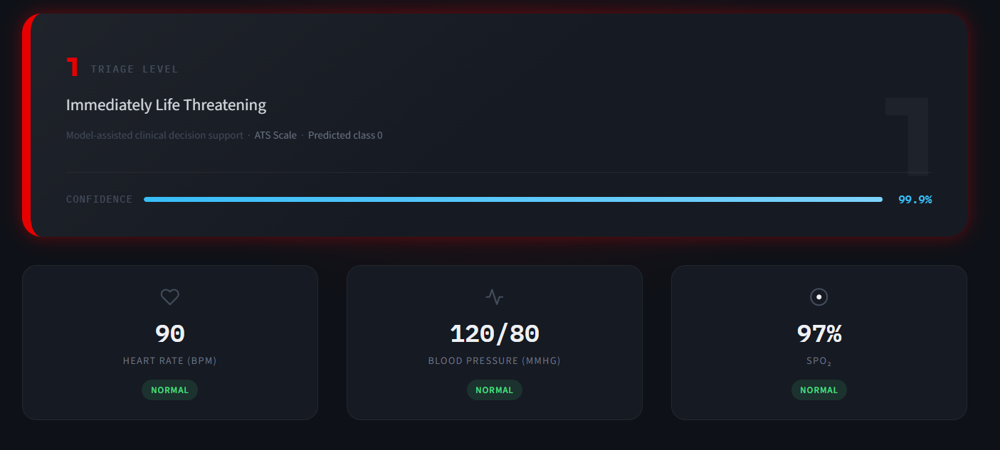
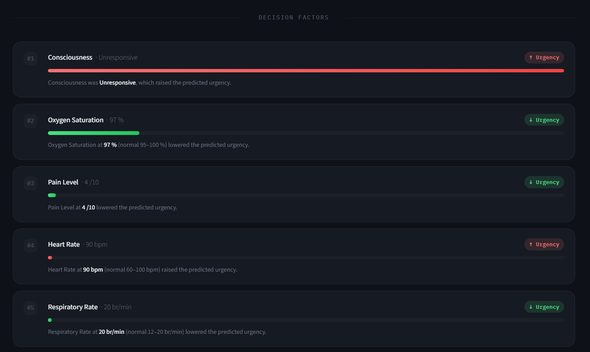

# 🏥 ER Flow - An AI-Powered System That Automates Triage In The ER

This project focuses on the classifying patients in the emergency room by analysing their vitals and presenting condition. This system is designed to support healthcare workers by enhancing ER workflows with triage recommendations that are explainable, fast and consistent.

---

## 📌 Project Overview

Emergency departments often face problems of over-crowding and time-critical situations. This project aims to improve work flow by using machine learning to provide a triage level for a patient based on vitals and chief complaint. The triage system used is the Australasian Triage Scale (ATS):
``` text
1 : Life-threatening
2 : Imminent risk
3 : Potential deterioration
4 : Less severe
5 : Minor condition
```
The final model is trained using **XGBoost**, chosen for its strong performance on structured/tabular data.

---

## 🧪 Synthetic Data
This project uses synthetic data to simulate real emergency situations. 
No real patient data is used to ensure ethical and privacy compliance.

---

## 🧠 Ethical Considerations
- Uses synthetic data only.
- Focuses on transparency and explainability.
- Intended strictly for academic, research and demonstration purposes only.

## 🗂️ Project Structure
```text
The main application files are located in the 'app' folder. CSV-related files are stored in the 'data' folder, while model training and preprocessing files are in the 'notebooks' folder.
```
---

## 🧰 Tech Stack

- **Python**
- **Pandas & NumPy**
- **Scikit-learn**
- **XGBoost**
- **Jupyter Notebook**
- **Streamlit**
- **SHAP**
---
## 👨‍🍳 The Process 
---
## 🧹 Data Creation & Preprocessing

The creation of synthetic data includes:
- Replicating realistic patient data for prediction using NumPy.
- Adding edge-cases and missing values to replicate noise present in real-world datasets. 

All preprocessing steps are documented in: notebooks/data_cleaning.ipynb

---

## 🤖 Model

- **Algorithm:** XGBoost Classifier
- **Problem Type:** Classification
- **Goal:** Accurately classify triage level based on patient vitals. 
- **Explainability:** Model explainability introduced through SHAP. 

The model training and evaluation process can be found in: notebooks/model.ipynb


---

## ▶️ How to Run the Project

### 1. Clone the repository
```bash
git clone https://github.com/Jaden-Naidoo/ER-Flow.git
cd ER-Flow
```
### 2. Create the environment
```bash
conda env create -f environment.yml
conda activate er_triage_ml
```

### 3. Run the app
```bash
streamlit run app/ER_Flow.py
```
--- 
## 🚀 Future Improvements
In the future I would like to add the following:
- Improved UI design and experience
- Validating the model with real-life clinical data (ethically approved)
- Integration with existing healthcare emergency service systems

---
## 📬 Contact

Always down for a conversation — feel free to reach out if anything here interests you or if you want to talk about data science/machine learning in general.

---

## 📌 Disclaimer

This project is for educational and research purposes only.
It is not a certified medical device and must not be used for real-world decision making.
---

## 📸 Dashboard Screenshots

### Overview of Entering Features For Triage Classification


### Triage Classification  Example


### SHAP Explainability Example
